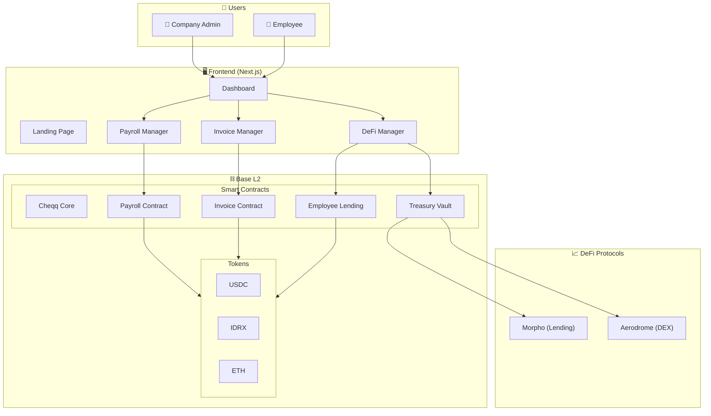
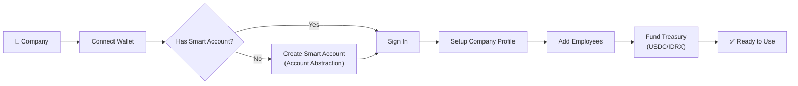
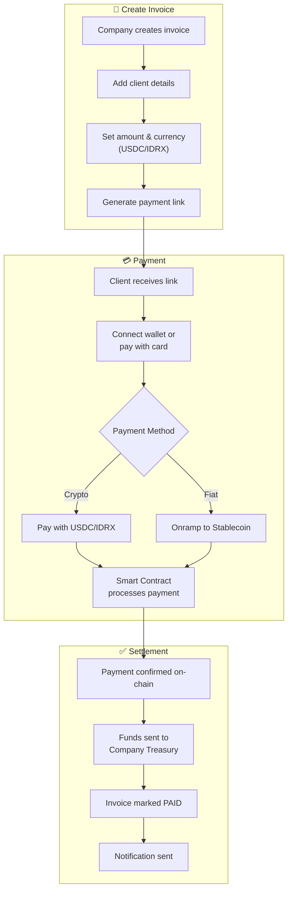
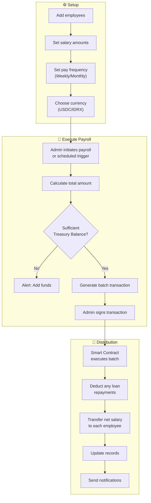
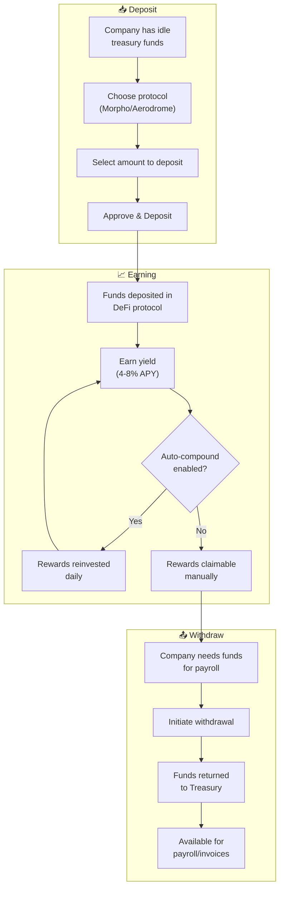
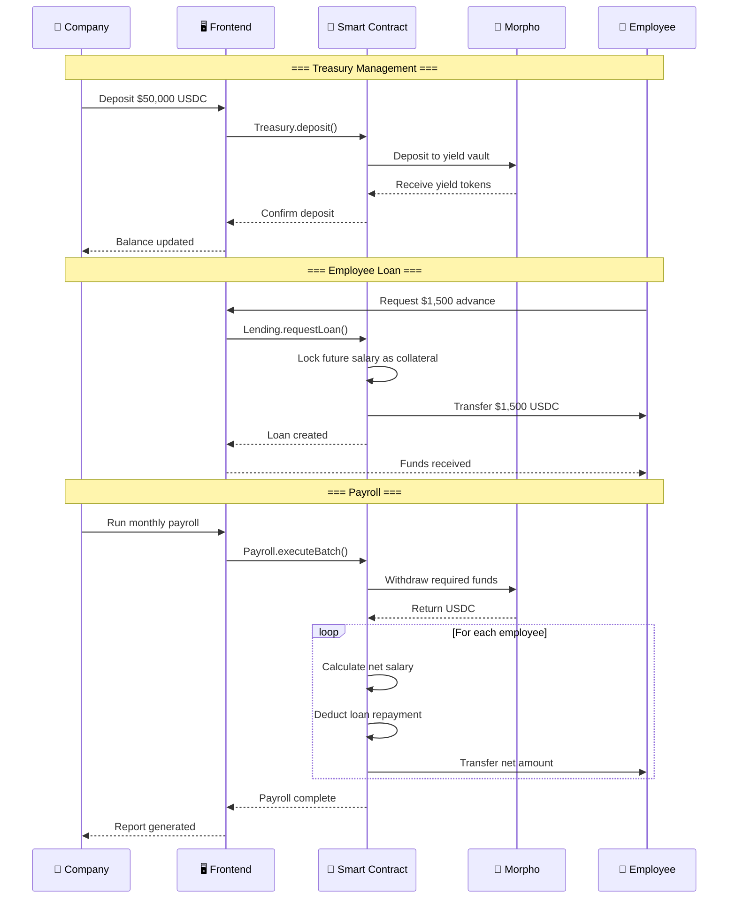
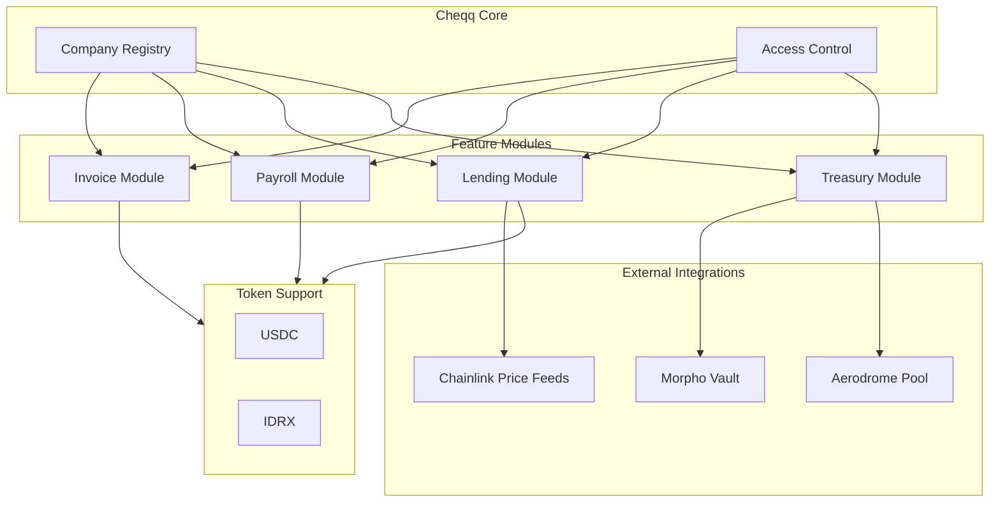
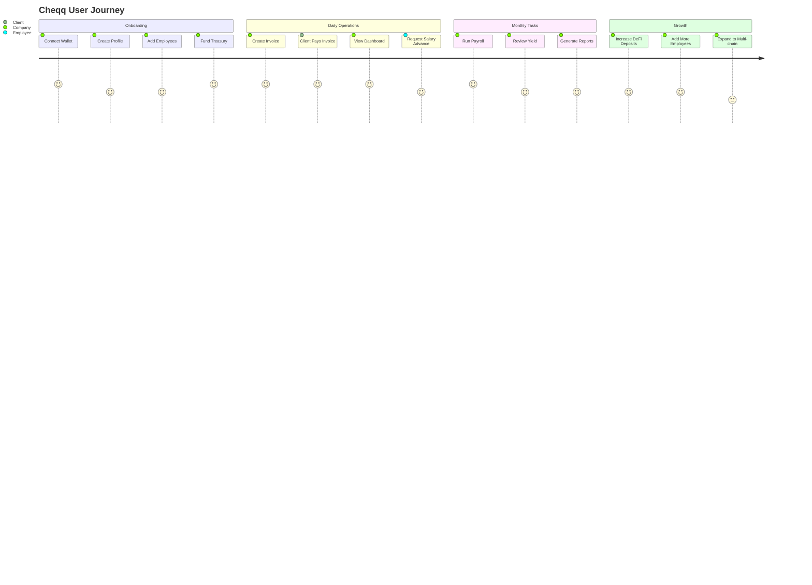

# Cheqq - System Flow Charts

## 1. High-Level System Architecture

---

## 2. Company Onboarding Flow

---

## 3. Invoice Management Flow

---

## 4. Payroll Disbursement Flow

---

## 5. DeFi Yield Generation Flow

---

## 6. Employee Lending Flow (Key DeFi Feature)

---

## 7. Complete Transaction Flow (End-to-End)

---

## 8. Smart Contract Architecture

---

## 9. User Journey Map

---

## Summary

| Flow | Description |
|------|-------------|
| **Onboarding** | Company connects wallet → creates smart account → sets up profile |
| **Invoice** | Create invoice → client pays via link → instant settlement |
| **Payroll** | Set schedules → batch payments → auto loan deductions |
| **DeFi Yield** | Deposit treasury → earn APY → compound or withdraw |
| **Employee Lending** | Request advance → collateralized by salary → auto repayment |

---

> 💡 **Key Innovation**: Employee loans are collateralized by **future payroll**, creating a unique DeFi primitive that reduces risk while providing employees with financial flexibility.
